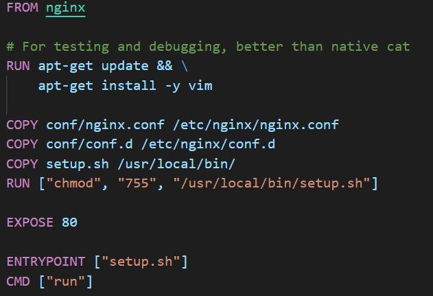

# Docker Containers with a reverse proxy, a static HTTP server and a dynamic HTTP server with AJAX request

- ## Docker Container with a reverse proxy, a static HTTP server and a dynamic HTTP server with AJAX request

  + [Description](#description)
  + [Configuration](#configuration)
    * [Dockerfile](#dockerfile)
    * [Nginx](#nginx)
      + [nginx.conf](#nginxconf)
      + [conf.d/default.conf](#confd-defaultconf)
  + [Instructions to setup container](#instructions-to-setup-container)
    * [Build images](#build-images)
    * [Run containers](#run-containers)
  + [Accessing content](#accessing-content)

### Description

The docker image of our reverse proxy is based on [Nginx](https://hub.docker.com/_/nginx) contains a configuration to dispatch request to the right container. The server has two endpoint : ***\*/\****, which redirect to the static docker and the second endpoint : **/api/student**. The port exposed is the default HTTP port which is 80.

The page served by the static HTTP server is updated with the informations fetched (with AJAX queries, every two seconds) from the dynamic HTTP server.

### AJAX code explanations

```javascript
$(function() {
    console.log("Loading Students...");

    function loadStudents() {
            // Fetch informations (JSON) from the dynamic server
            $.getJSON("/api/student/", function( students ) {
                    console.log(students);
                    // Construction of the message to show
                    // Default value
                    var message = "Nobody is here";
                    if( students.length > 0) {
                            // If there is an animal in the response, we take the first one of the array and construct the message
                            message = "Animal : " + students[0].animal + ", Profession : " + students[0].profession;
                    }
                    // We update the elements of the class white-text of the page to show our message
                    $(".white-text").text(message);
            });
    };
    // We call the function to display the informations instantly at the loading
    loadStudents();
    // We call the method to update the message every 2 seconds
    setInterval( loadStudents, 2000);
});
```

Comments inline.

### Configuration	

##### Dockerfile



1. We take the latest Nginx image from the Docker Hub
2. We copy the server configuration in the docker image of Nginx server
3. As we wanted to have an evolutive architecture, we copy specific sub-configuration that are included in the Nginx configuration
4. We update the package repository of our image operating system
5. We install vim to be able to debug the Nginx server
6. We are exposing our traffic to the default HTTP port, 80

##### Nginx

###### nginx.conf


- **events** : this statement is mandatory in the configuration. It is for setting the context of our server. Here we don't need any particular global options
- **http** : 
  - **include** : to be able to show all the MIME types encoding
  - **log_format** : to get logs in the windows where you run the container
  - **access_log** : logs on the server
  - **include** : including all sub configurations

###### conf.d/default.conf


- **listen** : servre is listenning to the port 80
- **location /** : all request starting with **/** will get redirected to the static container
- **location = /api/student/** & **location = /api/student** : all request that are stricly /api/student or /api/student/ will get redirected to the dynamic container

### Instructions to setup container

##### Build images

To setup the infrastructure  you first need to build the image of our static website :

```shell
docker build -t melmot/static static/ #if you're at the root of the project
```

Then you need to build our dynamic REST API :

```shell
docker build -t melmot/dynamic dynamic/ #if you're at the root of the project
```

And finally, you will need to build the reverse proxy image : 

```shell
docker build -t melmot/reverse reverse/ #if you're at the root of the project
```

##### Run containers

First, you need to run the static container without exposing the ports :

```
docker run melmot/static 
```

Second, you need to run the dynamic container without exposing the ports : 

```
docker run melmot/dynamic 
```

Finally, you need to run the reverse proxy container exposing the ports to be able to contact it : 

```
docker run -p %your_local_port%:80 melmot/reverse 
```

We already create a little script (**setup.sh**) at the root of the project to do the all the steps above, mapping the reverse proxy on the port **3333**.

### Accessing content

To access the static container content, you have to go to :

```
http://localhost:%your_local_port%/
```

and to access our dynamic container content, you have to go to : 

```
http://localhost:%your_local_port%/api/student
```

