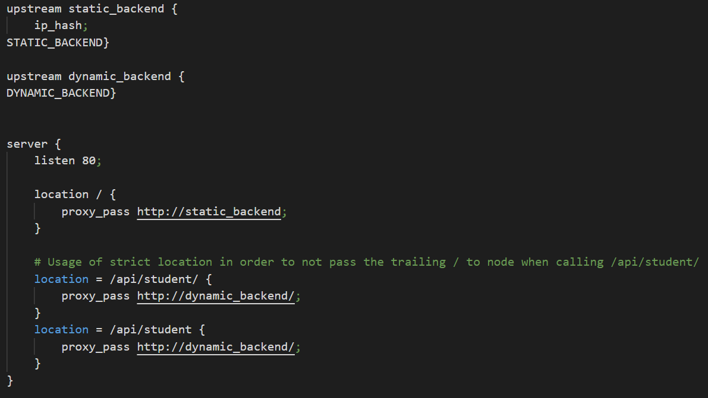

# Docker Container running a reverse proxy with nodes IP taken from env variables

- ## Docker Container running a reverse proxy with nodes IP taken from env variables

  + [Description](#description)
  + [Configuration](#configuration)
    * [Dockerfile](#dockerfile)
    * [Setup Nginx](#setup_nginx)
    * [Nginx](#nginx)
      + [nginx.conf](#nginxconf)
      + [conf.d/default.conf](#confd-defaultconf)
  + [Instructions to setup container](#instructions-to-setup-container)
    * [Build images](#build-images)
    * [Run containers](#run-containers)
  + [Accessing content](#accessing-content)

### Description

The docker image of our dynamic reverse proxy is based on [Nginx](https://hub.docker.com/_/nginx) contains a configuration to dispatch request to the right container. The server has two endpoint : ***\*/\****, which redirect to the static docker and the second endpoint : **/api/student**. The port exposed is the default HTTP port which is 80. The environment variables STATIC_APP and DYNAMIC_APP passed with -e in the run command will update the nginx configuration.

The page served by the static HTTP server is updated with the informations fetched (with AJAX queries, every two seconds) from the dynamic HTTP server.

### Configuration	

##### Dockerfile


1. We take the latest Nginx image from the Docker Hub
2. We update the package repository of our image operating system
3. We install vim to be able to debug the Nginx server
4. We copy the server configuration in the docker image of Nginx server
5. As we wanted to have an evolutive architecture, we copy specific sub-configuration that are included in the Nginx configuration
6. We copy the setup configuration for our server to the Nginx server
7. We are exposing our traffic to the default HTTP port, 80
8. We launch the setup script to launch our server

**Setup Nginx**


In this script, we are mapping the environment variables (given in the command to run the docker container) with the variables inside our Nginx configuration.

Then we start our server without deamons.

##### Nginx

###### nginx.conf


- **events** : this statement is mandatory in the configuration. It is for setting the context of our server. Here we don't need any particular global options
- **http** : 
  - **include** : to be able to show all the MIME types encoding
  - **log_format** : to get logs in the windows where you run the container
  - **access_log** : logs on the server
  - **include** : including all sub configurations

###### conf.d/default.conf



- **listen** : server is listening to the port 80
- **location /** : all request starting with **/** will get redirected to the static container
  - **STATIC_URL** is a variable and gets mapped with the setup script 
- **location = /api/student/** & **location = /api/student** : all request that are stricly /api/student or /api/student/ will get redirected to the dynamic container
  - **DYNAMIC_URL** is a variable and gets mapped with the setup script 

### Instructions to setup container

##### Build images

To setup the infrastructure  you first need to build the image of our static website :

```shell
docker build -t melmot/static static/ #if you're at the root of the project
```
Then you need to build our dynamic REST API :

```shell
docker build -t melmot/dynamic dynamic/ #if you're at the root of the project
```
And finally, you will need to build the dynamic reverse proxy image : 

```shell
docker build -t melmot/dyn_reverse dyn_reverse/ #if you're at the root of the project
```
##### Run containers

First, you need to run the static container without exposing the ports :

```
docker run melmot/static 
```

Second, you need to run the dynamic container without exposing the ports : 

```
docker run melmot/dynamic 
```

Finally, you need to run the dynamic reverse proxy container exposing the ports to be able to contact it and we will add two environment variables with the option **-e** : 

```
docker run -e DYNAMIC_APP=%your_dynamic_app_ip%:%your_dynamic_app_port% -e STATIC_APP=%your_static_app_ip%:%your_static_app_port% --name dyn_reverse -p %your_local_port%:80 melmot/dyn_reverse
```

We already create a little script (**setup.sh**) at the root of the project to do the all the steps above, mapping the reverse proxy on the port **4444**.

### Accessing content

To access the static container content, you have to go to :

```
http://localhost:%your_local_port%/
```

and to access our dynamic container content, you have to go to : 

```
http://localhost:%your_local_port%/api/student
```
