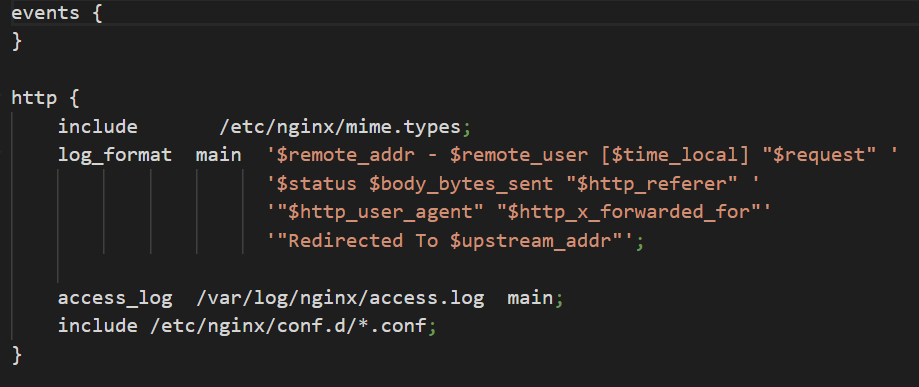

# Docker Container running a static HTTP server

- ## Table of contents
    + [Description](#description)
    + [Configuration](#configuration)
        * [Dockerfile](#dockerfile)
        * [Nginx](#nginx)
    + [Instructions to setup container](#instructions-to-setup-container)
    + [Accessing content](#accessing-content)

### Description

This docker image based on [Nginx](https://github.com/nginxinc/docker-nginx) contains a static HTTP website served by Nginx. The port exposed is the default HTTP one, 80.

### Configuration

##### Dockerfile


1. We take the latest Nginx image from the Docker Hub
2. We copy the src folder (containing the sources) to the folder served by nginx (*/usr/share/nginx/html*)
3. We copy the server configuration in the docker image of Nginx server
4. We update the package repository of our image operating system
5. We install vim to be able to debug the Nginx server
6. We are exposing our traffic to the default HTTP port, 80 

##### Nginx



- **events** : this statement is mandatory in the configuration. It is for setting up the context of our nginx instance. In our case, we don't need any particular global options.
- **location /** : Every URL that starts with **/** will use the files that are located in the **root** html folder(which means our *index.html* located in */usr/share/nginx/html*)

### Instructions to setup container

To setup the container, you first need to build the image :

```shell
docker build -t melmot/static static/ #if you're at the root of the project
```

Then you can run the built image :

```
docker run -p %your_local_port%:80 melmot/static 
```

We already create a little script (**setup.sh**) at the root of the project to do the two step above, mapping on the port **5555**.

### Accessing content

To access the webpage, you can go to :

```
http://localhost:%your_local_port%/
```

